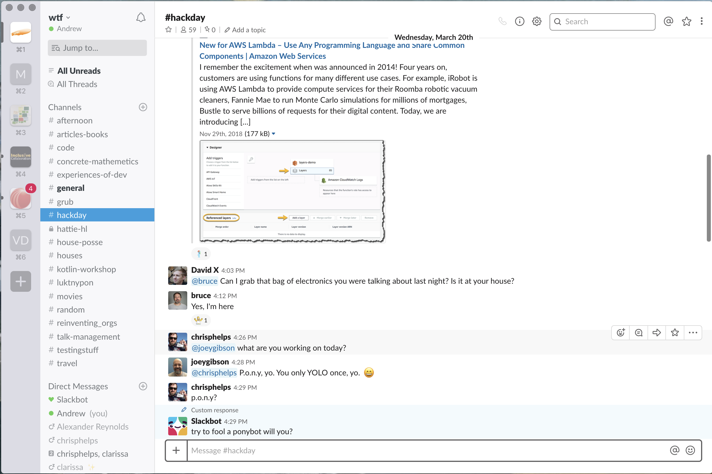
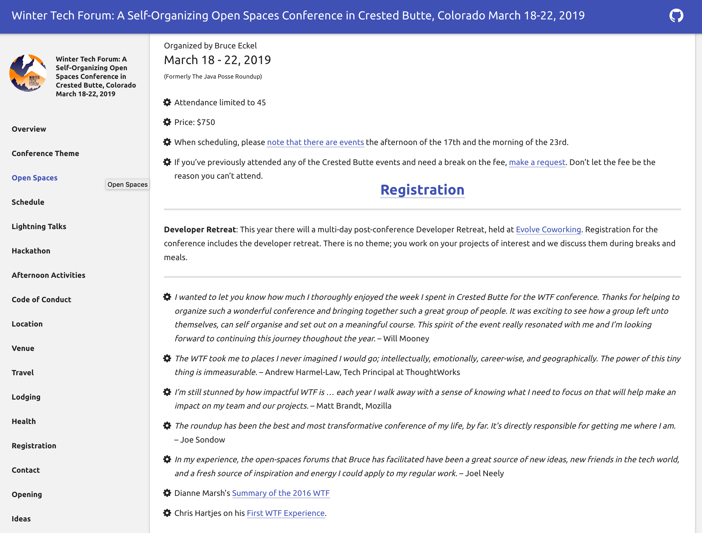
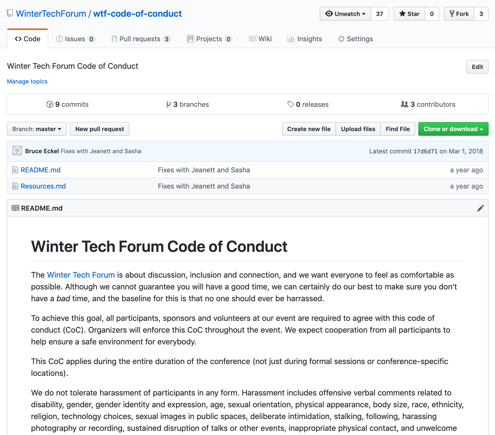

## **Invert Your Participation Mode**
#### or How Open Spaces Conferences Change Everything (and How to Run One)

--- 

## Who Am I?

---?image=assets/img/event-amateur-wtf2019-dkarlinsky.jpg&size=auto 100%&position=right

Note: 
I'm an “Event Amateur”
 - Developer / Principal at ThoughtWorks (a global consultancy)
 - Attended, participated in, co-organised, sponsored and put on numerous tech events over the years, nationally and internationally
 - The best fun has been speaking, and open spaces. 
 - Hopefully some / all of what I’m about to share will be useful to you. 
 - I've only a short period of time, so I want to tell you about attending my first open spaces, and then about putting on my first open spaces. 
 - I'd be SUPER-HAPPY to take questions, and have a chat about all this at the end or afterwards over social media or whatever. (I could talk about this FOR EVER.)

---

## Attending an Open Space Conference...

---?image=assets/img/the-java-posse.jpg&size=auto 100%&position=right

Note:
The Java Posse
 - Spin off from a tech podcast. 
 - Organised by the podcasters, plus a famous tech luminary. 
 - They’d recorded sessions and put them out on the podcast as episodes 

---?image=assets/img/Crested-Butte.jpg&size=auto 100%&position=right

Note:
Crested Butte
 - Ex-mining, now skiing town, 8 hrs drive into the Rockies from Denver. 
 - Church hall, one main space, and 4 smaller spaces (one was the coffee shop round the corner)
 - Theme: (can’t remember now)

---?image=assets/img/arriving-wtf-2019-dkarlinsky.jpg&size=auto 100%&position=right

Note:
Arrival
 - Joined a house rented by others (organised previously via email - now it's slack which people are invited to when they pay their fee)
 - Others who had been there previously were putting up pieces of paper and collecting “you can record me” consent forms. 

---?image=assets/img/introduction-wtf2019-aharmel-law.jpg&size=auto 100%&position=right

Note:
The Welcome / Introduction Session
 - Kicked off by Bruce. 
 - We were all in a circle. After warning about altitude sickness he explained the expectations, the mechanics, how to lead a session and how to attend one (invert your participation mode) and the one rule. 

---?image=assets/img/Full-Boards-AndrewHarmel-Law.jpg&size=auto 100%&position=right

Note:
 - Then we had ten mins to organise - the “pieces of paper” were empty agendas, with spaces for each session, in each track. 
 - There were three sessions a day, in the morning. The afternoons were free. The evenings were lightning talks. 
 - People proposed sessions (title, and proposer) and put it in a slot. To begin with, there weren’t many. But the first 5 slots filled up. Then the time to kick of the sessions came around and we went to our sessions. 
 - After the first session a LOT MORE sessions got proposed. People also started curating the agenda (they had to) based on clashes, similarities, and more. 

---?image=assets/img/skiing-wtf2019-dkarlinsky.jpg&size=auto 100%&position=right

Note:
The afternoons also filled up - hackathons, demos, cross-country skiing, and more. This all self-organised. Lunches and dinners self-organised too. 

---

Note:
We'd also built a community - in the intervening 53 months of the year we kept up with each other on slack and email.

---

Note:
I kept going back.  I had some of the most rewarding and self-developmental experiences of my entire career.

---

## Curating an Open Space Conference... 

---?image=assets/img/karaoke-wtf2019-pavery.jpg&size=auto 100%&position=right

Note:
So much appeared to happen “as if by magic” those first few times. 

When I did it myself, when I brought the roundup to the UK for the first time, and when I put on the Devoxx spin-off Unvoxxed, I realised what was happening behind the scenes. 

---?image=assets/img/bruce-and-huskies-wtf2019-gweakliem.jpg&size=auto 100%&position=right

Note:
Bruce actively sought to do as little as possible, but also he strove to create a community. One that was welcoming and inclusive.  This takes effort.  Effort to stay out of the way, but also effort to watch what is going on, and, behind the scenes, make sure nothing is being abused / undermined.

---?image=assets/img/pizza-kills-wtf2019-aharmel-law.jpg&size=auto 100%&position=right

Note:
Speaking to people in the background - very like the Quaker Model of disruptors at meeting

It won't be for everyone. You need to manage that too.

---

Note:
A Code of Conduct

---?image=assets/img/church-hall-lightning-talks-wtf2019-aharmel-law.jpg&size=auto 100%&position=right

Note:
The right space

---?image=assets/img/laptop-stickers.jpg&size=auto 100%&position=right

Note:
He didn’t have to worry much about marketing / advertising as he was famous, had a massive network, and didn’t mind how big or small something was. 

I did, and it can be hard to explain what something like this is. What I did do (semi-successfully) was emphasise the fact that to attend would mean you’d get to engage with luminary X and famous person Y. You need to have them in attendance to do this, but that’s not impossible. And they’ll invariably love it when they attend too. 

---?image=assets/img/yurt-dinner-wtf2019-dkarlinsky.jpg&size=auto 100%&position=right

Note:
There are no “sponsors” but bringing schwag and sponsoring a dinner is fine. 

---?image=assets/img/plane-at-montrose.jpg&size=auto 100%&position=right

Note:
This raises another problem for delegates. Selling it to their boss. A conference that makes itself is a hard sell. 
This is the main reason the Open Spaces I attend have themes - so they sound valuble to the people paying

---

## Conclusions...

---

## "Invert your organisation mode"

Note:
I'm aware, having contributed to setting up and running "classic" eyes-front conferences, that almost everything about Open Spaces will sound different.

It's very much "invert your organisation mode"

Hopefully I've given you enough info on how to run one that your interest is piqued.

---

But if there's so little for you as an event professional to do, why should you care about them?

I've a few reasons:

---

1. there _is_ a need for you, but not in the area of the last-minute, running-around busy-work - it's the fun, human, experience-facilitation stuff
1. consequently they take up a lot less of your time
1. once you get confident you can experiment - every year we’d try some changes
1. it'll restore your faith in humanity, and hence your energy banks - it's like a detox

Note:
I've a few reasons:

1. there _is_ a need for you, but it's not in the area of the last-minute, running-around busy-work - it's the fun, human, experience-facilitation stuff (It's MASSIVELY rewarding)
1. Consequently they take up a lot less of your time
1. Once you get confident you can experiment - every year we’d try some changes. Some would work (slack) some didn’t (an online board)
1. it'll restore your faith in humanity, and hence your energy banks - it's like a detox

---

## What questions do you have?

Contact me!: @al94781

---
