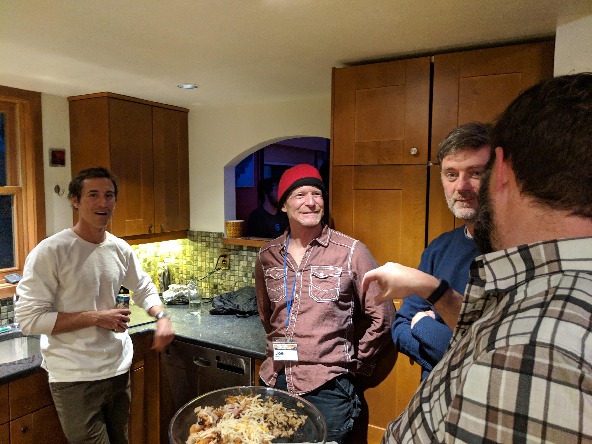
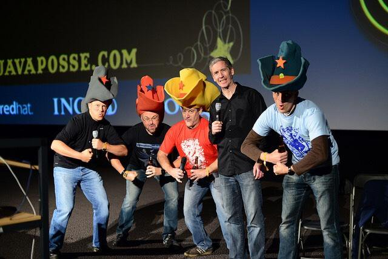
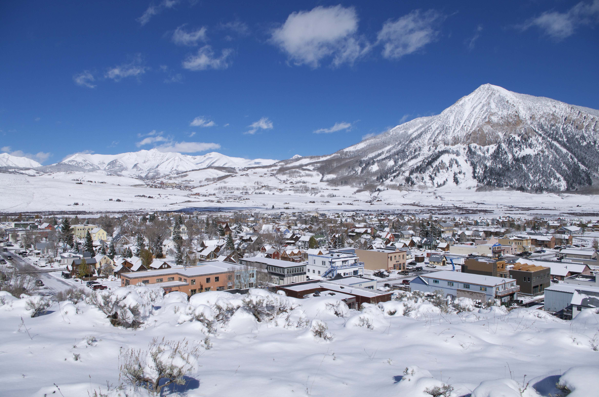
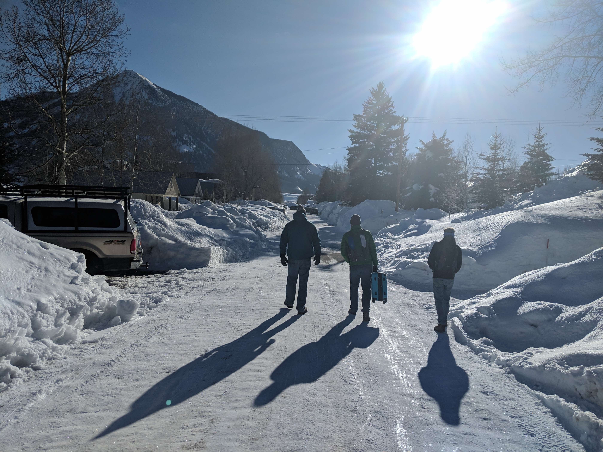
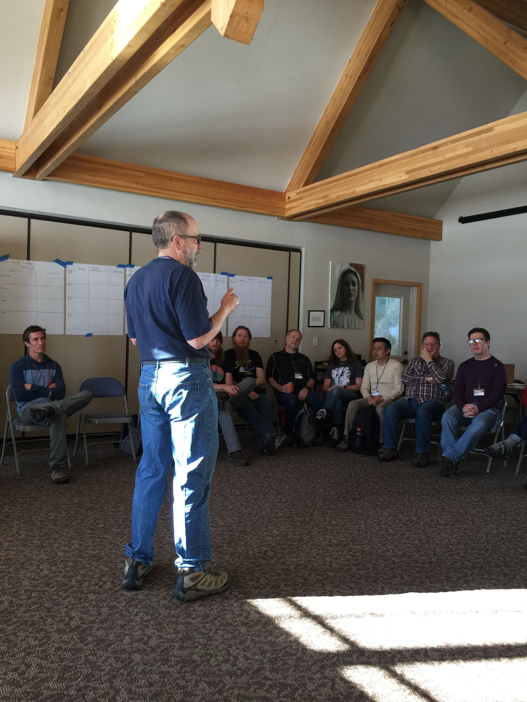

# Invert Your Participation Mode
#### or How Open Spaces Conferences Change Everything (and How to Run One)

--- 

## Who Am I?

---

 
## “Event Amateur”

Note: 
 - Developer / Principal at ThoughtWorks (a global consultancy)
 - Attended, participated in, co-organised, sponsored and put on numerous tech events over the years, nationally and internationally
 - The best fun has been speaking, and open spaces. 
 - Hopefully some / all of what I’m about to share will be useful to you. 
 - I've only a short period of time, so I want to tell you about attending my first open spaces, and then about putting on my first open spaces. 
 - I'd be SUPER-HAPPY to take questions, and have a chat about all this at the end or afterwards over social media or whatever. (I could talk about this FOR EVER.)

---

## Attending Open Spaces

---

## The Java Posse

Note:
 - Spin off from a tech podcast. 
 - Organised by the podcasters, plus a famous tech luminary. 
 - They’d recorded sessions and put them out on the podcast as episodes 

---

## Crested Butte

Note:
 - Ex-mining, now skiing town, 8 hrs drive into the Rockies from Denver. 
 - Church hall, one main space, and 4 smaller spaces (one was the coffee shop round the corner)
 - Theme: (can’t remember now)

---

### Arrival

Note:
 - Joined a house rented by others (organised previously via email - now it's slack which people are invited to when they pay their fee)
 - Others who had been there previously were putting up pieces of paper and collecting “you can record me” consent forms. 

---

### The Welcome / Introduction Session

Note:
 - Kicked off by Bruce. 
 - We were all in a circle. After warning about altitude sickness he explained the expectations, the mechanics, how to lead a session and how to attend one (invert your participation mode) and the one rule. 

---

Note:
 - Then we had ten mins to organise - the “pieces of paper” were empty agendas, with spaces for each session, in each track. 
 - There were three sessions a day, in the morning. The afternoons were free. The evenings were lightning talks. 
 - People proposed sessions (title, and proposer) and put it in a slot. To begin with, there weren’t many. But the first 5 slots filled up. Then the time to kick of the sessions came around and we went to our sessions. 
 - After the first session a LOT MORE sessions got proposed. People also started curating the agenda (they had to) based on clashes, similarities, and more. 

---

### Pics: Hackathons / Skiing / Food

The afternoons also filled up - hackathons, demos, cross-country skiing, and more. This all self-organised. Lunches and dinners self-organised too. 

---

### Pic: Slack chat

We'd also built a community - in the intervening 53 months of the year we kept up with each other on slack and email.

---

### Pic: My quote on the WTF website

I kept going back.  I had some of the most rewarding and self-developmental experiences of my entire career.

(Quote from the WTF website)

---

# Part 2 - Things I learned when styaging Open Spaces 

---

### Pic: Magical interaction

So much appeared to happen “as if by magic” those first few times. 

When I did it myself, when I brought the roundup to the UK for the first time, and when I put on the Devoxx spin-off Unvoxxed, I realised what was happening behind the scenes. 

---

### Pic: Bruce participating

Bruce actively sought to do as little as possible, but also he strove to create a community. One that was welcoming and inclusive.  This takes effort.  Effort to stay out of the way, but also effort to watch what is going on, and, behind the scenes, make sure nothing is being abused / undermined.

---

### Pic: Code of conduct

A Code of Conduct

---

### Pic: 1-1 conversation

Speaking to people in the background - very like the Quaker Model of disruptors at meeting

It won't be for everyone. You need to manahge that too.

---

### Pic: The church hall / Rumors / People's houses

The right space

---

### Pic: Schwag (my laptop)

He didn’t have to worry much about marketing / advertising as he was famous, had a massive network, and didn’t mind how big or small something was. 

I did, and it can be hard to explain what something like this is. What I did do (semi-successfully) was emphasise the fact that to attend would mean you’d get to engage with luminary X and famous person Y. You need to have them in attendance to do this, but that’s not impossible. And they’ll invariably love it when they attend too. 

---

### Pic: Aeroplane / travelling

This raises another problem for delegates. Selling it to their boss. A conference that makes itself is a hard sell. 

This is the main reason the Open Spaces I attend have themes - so they sound valuble to the people paying

---

### Pic: Yurt dinner

There are no “sponsors” but bringing schwag and sponsoring a dinner is fine. 

---

### Pic: Everyone

Numbers: 70/80 is the max

---

# Conclusions

---

## "Invert your organisation mode"

I'm aware, having contributed to setting up and running "classic" eyes-front conferences, that almost everything about Open Spaces will sound different.

It's very much "invert your organisation mode"

Hopefully I've given you enough info on how to run one that your interest is piqued.

---

But if there's so little for you as an event professional to do, why should you care about them?

I've a few reasons:

1. there is a need for you, but it's not in the area of the last-minute, running-around busy-work - it's the fun, human, experience-facilitation stuff (It's MASSIVELY rewarding)
1. Consequently they take up a lot less of your time
1. Once you get confident you can experiment - every year we’d try some changes. Some would work (slack) some didn’t (an online board)
1. it'll restore your faith in humanity, and hence your energy banks - it's like a detox

---

My Contact details:
...

---

ORIGINAL SLIDES FOLLOW

---

# Who Am I?

 - I'm not an event professional (I'm a software developer)
 - but I've participated in a _lot_ of Open Spaces
 - And I've put on a few too

---

I've made this deck so you can use it to help you put on an Open Space.

---

# What Are Open Spaces?

--- 

What's the best thing that happened at the last conference you attended?

 - It was most likely a hallway conversation, 
 - or a quick chat you had with a speaker after their talk
 - or perhaps a chance meetup in an after-hours pub with someone who went to the same session you did

---

# Open Spaces are a simple methodology for Self Organising conferences

They take the best bits, and make a whole experience out of them.

---

Sessions are conversations, curated and led entirely by attendees

---

Prepare to be surprised by the depth and breadth of topics that are discussed

---

Frequently other aspects self-organise too

---

Each Open Space experience is unique in some way.

(Quite often topics will be raised which are off the topic of the originally proposed topic) 

---

So what do you (the Event Professional) need to do?

 - Source the theme / topic
 - Find and book the space
 - Create the empty agenda
 - Welcome attendees and kick things off 
 
(more on each of these later)

---

# What Open Spaces Aren't

 - Over-organised - the less you do, and the more you leave things up to the attendees, the better they are
 - 

---

# What about "Unconferences"?

---

# The Benefits of Open Spaces

 - To the Attendee...
 - To the Organiser...
 
---

# How to Curate Open Spaces

---

# Making the concept non-intimdating

Potential attendees worry:
 - can I contribute anything?
 - Do I need to prepare anything?

---

# Picking a Theme

---

# Finding and Booking the Event Space

---

# Welcome / Kickoff

You need to cover:
 - Open Spaces Guidelines
 - The Law of Two Feet
 - How to Lead and How to Attend Open Spaces Sessions
 - Inverting Your Participation Mode

---

# What Can Be Hard

 - Attendees writing business cases to attend
 - Finding the right space
 - You still need a Code of Conduct
 - It won't be for everyon
